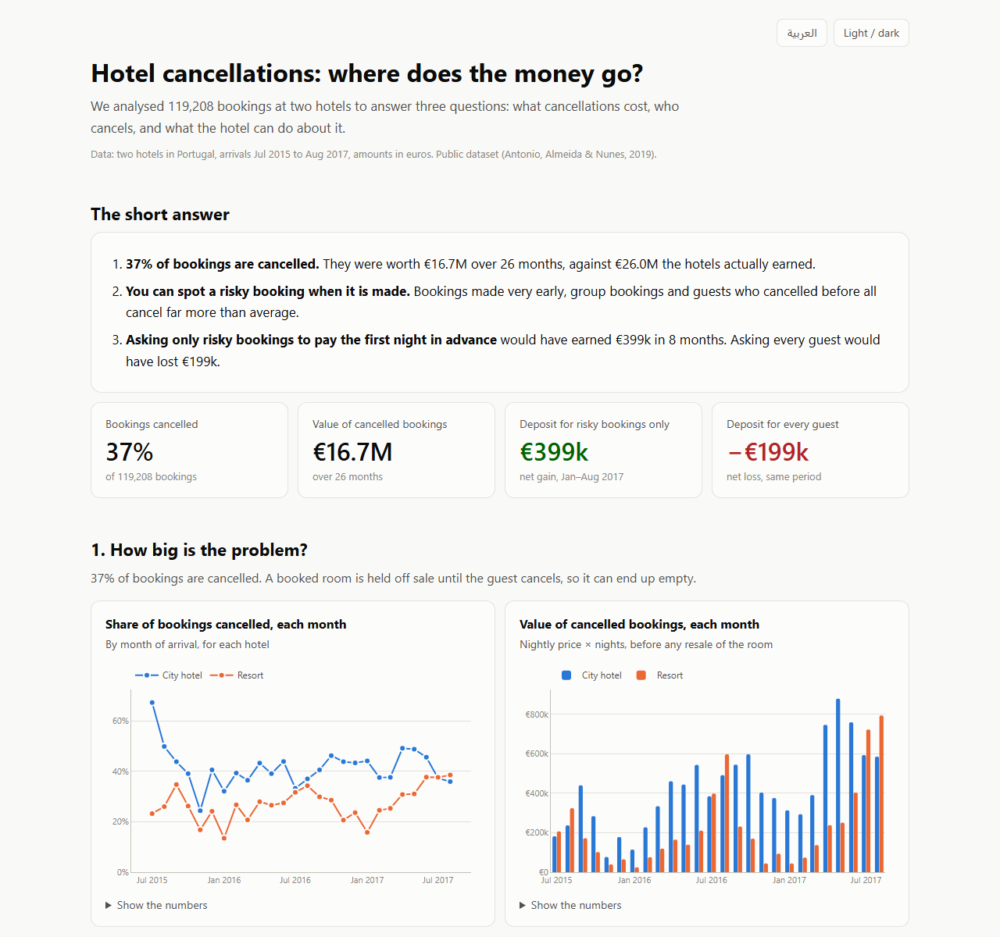

# Hotel Cancellation Analytics

**[Open the live dashboard](https://yahia20.github.io/hotel-revenue-analytics/)** (English and Arabic) ·
[اقرأ بالعربية](README.ar.md)

## The short answer

1. **37% of hotel bookings are cancelled.** At two hotels, those bookings were worth €16.7M over 26
   months, against €26.0M the hotels actually earned.
2. **A risky booking can be spotted when it is made.** Bookings made far in advance, group bookings and
   guests who cancelled before cancel far more than average.
3. **Ask only risky bookings for the first night in advance.** Tested on 2017 bookings the model never
   saw, this would have earned **€399k** in eight months. Asking every guest would have **lost €199k**.

Everything runs with one command: raw data → checked data warehouse → prediction model → policy test →
dashboard.



## Results

| | |
|---|---|
| Bookings analysed | 119,208 of 119,390 (182 excluded by documented rules) |
| Cancellation rate | 37.1% |
| dbt data tests | 28 on every run, 0 failing (1 documented warning) |
| Reconciliation | source rows and revenue reconcile exactly, from source file to dashboard |
| Model, Jan–Aug 2017 | ROC AUC 0.850, accuracy 77.6% (always guessing "stays" scores 61.3%) |
| Weekly cancellation forecast | 9.0% average error; 8-month total 6.4% under |
| Targeted deposit, Jan–Aug 2017 | +€399k base case; +€147k to +€1.2M across all 12 assumption pairs |

### Why the accuracy is 77.6% and not 99%

Notebooks that use this dataset often report 95–99%. The same model scores higher here too if you set
up the test the way those notebooks do:

| Test setup | Accuracy |
|---|---|
| Always guess "stays" | 61.3% |
| **This project: trained on the past, scored month by month on 2017** | **77.6%** |
| Shuffled random split | 84.9% |
| Shuffled split + columns filled in after booking | 88.7% |

Two things inflate the score:

1. **Leaky columns.** The source records every field as of arrival or cancellation. A parking space is
   only recorded when the guest arrives, so no cancelled booking has one. The assigned room is set at
   check-in, and the country is corrected at check-in. None of these exist when the booking is made,
   so they are excluded. The list is in [`features.py`](src/hotel_analytics/features.py). Reports of 99%
   usually include `reservation_status`, which is the answer itself.
2. **Random splits.** About 40,000 rows have an identical twin, mostly from group and tour-operator
   blocks. A shuffled split puts one twin in training and the other in the test set.

Here the model is scored the way it would run in a hotel. At the start of each month it is retrained
on every arrival whose outcome is already known, then it scores that month's bookings.

## The deposit policy

**Rule:** a no-deposit booking whose predicted risk is at or above a threshold pays the first night,
non-refundable.

- **Flagged booking that would have cancelled:** the hotel keeps the first night, unless the guest books
  elsewhere instead.
- **Flagged booking that would have stayed:** some guests walk away at the deposit request. The hotel
  loses the stay, minus what it recovers by reselling the room.

The data has no record of guests who were asked for a deposit and left. So the **walk-away rate** and
the **resale rate** are assumptions, and results are reported across a grid of both. The base case is
20% walk-away and 30% resale. The threshold is chosen on Sep–Dec 2016 and applied unchanged to 2017.

| Net, Jan–Aug 2017 | resale 0% | resale 30% | resale 60% |
|---|---|---|---|
| walk-away 5% | €983k | €1,085k | €1,205k |
| walk-away 10% | €655k | €777k | €981k |
| walk-away 20% | €297k | **€399k** | €610k |
| walk-away 30% | €147k | €219k | €358k |

Targeting is what makes the policy work. At 20–30% walk-away, a deposit for everyone loses money in five
of the six cases, up to €1.9M. Before a rollout, run the rule as an A/B test on a share of bookings to measure the real
walk-away rate.

## How it is built

```
data/raw/hotel_bookings.csv          source, checked against a SHA-256 on every run
        │
warehouse/ (dbt + DuckDB)
  staging/stg_bookings               typed, renamed, data-quality flags, no rows dropped
  marts/fct_bookings                 bookings used for analysis
  marts/fct_room_nights              one row per booked night
  marts/mart_daily_occupancy         rooms sold / cancelled / revenue per hotel per night
  marts/mart_monthly_kpis            monthly KPIs per hotel
  marts/mart_cancellation_drivers    cancellation rate by every booking-time attribute
  tests/                             reconciliation tests + generic tests
        │
src/hotel_analytics/
  model.py      LightGBM, monthly walk-forward scoring, leakage and split comparisons
  policy.py     deposit-policy backtest with the assumption grid
  dashboard.py  builds site/index.html from the warehouse and reports/
        │
site/index.html     static dashboard (Plotly), light and dark, table view under every chart
site/dbt-docs.html  warehouse lineage, column docs and tests
```

The dbt tests go beyond `not_null` and `unique`. They prove that nothing was lost or double-counted:

- every source row is in staging
- every staging row is either kept or excluded by a named rule
- revenue summed by booking, by night and by month agrees to the cent
- each slice of the drivers mart adds back up to every booking
- cancellations never fall after arrival
- arrivals stay inside the published window

### Data issues found and handled

| Issue | Rows | Action |
|---|---|---|
| Price above €1,000/night (one €5,400 night; next highest €510) | 1 | excluded |
| Negative price | 1 | excluded |
| Booking with no guests | 180 | excluded |
| Row identical to another row | 40,165 | kept: no booking ID exists, and the twins match group blocks |
| Country missing | 488 | kept as `UNK`; country is not a model input (it leaks) |
| Meal plan `Undefined` | – | merged into `SC` (no meal), per the dataset documentation |
| Checked-out stay shorter than booked | 27 | kept; dbt warning so a jump would show |

## Run it

Python 3.11+.

```bash
python -m venv .venv
.venv/Scripts/activate            # Windows; on macOS/Linux: source .venv/bin/activate
pip install -r requirements.txt
python run_pipeline.py            # downloads the data, builds and tests the warehouse, trains, backtests, builds the site
pytest                            # unit tests for the feature rules and the policy arithmetic
```

A full run takes about two minutes on a 4-core laptop. No GPU, paid API or cloud account is needed.
Open `site/index.html` in a browser.

## Data and limits

- **Source:** Hotel Booking Demand, Antonio, Almeida & Nunes, *Data in Brief* 22 (2019), CC BY 4.0. It
  covers two Portuguese hotels (a city hotel in Lisbon and a resort in the Algarve), with arrivals
  from July 2015 to August 2017.
- **Revenue** is room revenue (ADR × nights) in EUR, before any resale.
- **Special requests** may be added after booking. Without them, ROC AUC drops from 0.850 to 0.827. Read
  the policy result with that margin in mind.
- The method transfers to other hotels. The numbers do not.
